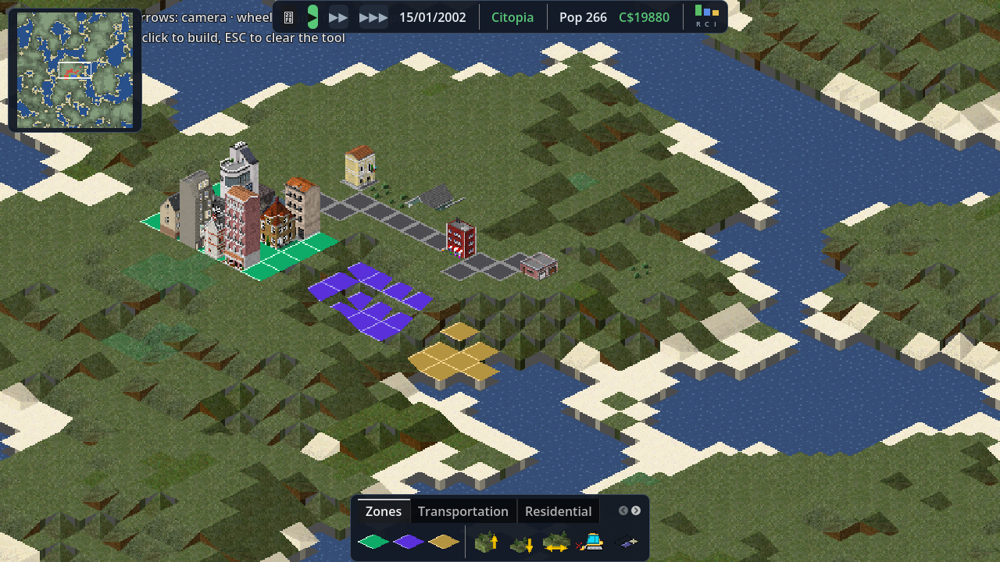
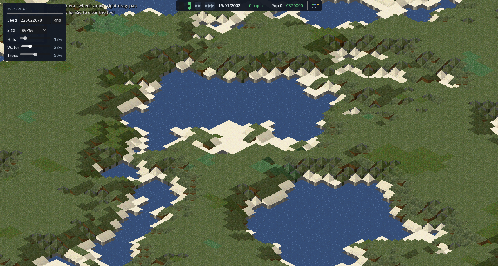

<div align="center">

# 🏙️ Citopia

**A free, open source retro pixel-art city building game.**

*The community GPL continuation of the amazing work by the
[Cytopia](https://github.com/CytopiaTeam/Cytopia) team, rebuilt on [Godot 4](https://godotengine.org).*

[](LICENSE)
[](https://godotengine.org)
[](#quick-start)
[](#roadmap)
[](https://discord.gg/FEUf6EwKbd)



*In-game HUD (v0.5): date & speed controls, population, funds, RCI indicator, minimap — and a downtown that grew on its residential zone.*



*The map editor at startup: seed, size, Hills / Water / Trees sliders with live regeneration, then Found City.*

</div>

---

## The story in a nutshell

Cytopia was 2,800 commits of pure passion: a custom isometric engine,
**827 tile types documented in JSON**, 909 pixel-art sprites, original
soundtracks — all released under GPL-3.

Then development went quiet in public… before resuming behind closed doors
with an announced license change. Everything that was ever published
**remains GPL forever**. Citopia carries that heritage forward, fully in the
open, on a modern and moddable engine.

## What works today

- 🗺️ **Isometric rendering** driven by the real Cytopia tile database
  (`TileData.json` used as-is: 827 tiles, sprite sheets, random per-tile
  variants)
- 🌱 **Procedural biome generation** (noise-based: lakes, beaches, grass,
  forests) — 96×96 map, easily extensible
- 🏗️ **Build & bulldoze**: hover highlighting (green/red), multi-cell
  footprints (2×2 buildings...), ground/water placement rules from the tile
  database, ghost preview, demo village (`godot scenes/main.tscn ++ --demo`)
- ⛰️ **Terrain elevation**: terraced hills (±1 step like the original),
  slope sprites decoded from the legacy sheets, hand-drawn textured cliff
  walls, raise/lower/level tools with drag-painting, animated showcase
  (`godot scenes/main.tscn ++ --demo-elevation`)
- 🏘️ **RCI zoning**: paint residential/commercial/industrial zones and
  watch buildings grow on their own (1×1 buildings from the 500+ database
  entries), de-zone tool, bulldozer clears buildings and zones
- 🛣️ **Roads & traffic**: paint roads by dragging (they auto-connect with
  the right sprite: intersections, corners, dead-ends) and watch cars drive
  the network — BFS pathfinding, right-hand lanes, fleet scaling with
  population. Maps are flat for now while traffic gets polished (the Hills
  slider is disabled in the map editor)
- 🖥️ **Game UI**: top bar with in-game date and pause/speed controls,
  live population and funds, mini RCI indicator, minimap with camera
  viewport (click to jump), build bar with category tabs browsing the
  **whole 827-tile database**
- 🗺️ **Map editor** at startup: seed, map size (48/96/192), Hills /
  Water / Trees sliders with live regeneration — then Found City
- 🎛️ **Build bar** with icons extracted from the sprite sheets
- 🎵 **Original soundtracks**: shuffled playlist of the Cytopia OST
- 🎥 **Smooth camera**: keyboard panning, cursor-centered mouse-wheel zoom,
  drag to pan
- 📦 **909 sprites + 50 MB of original soundtracks** already in the repo

## Roadmap

- [x] Tile hover, highlighting, place/demolish (the sandbox)
- [x] Audio: original playlist and sounds
- [x] RCI zones that grow buildings on their own
- [x] Map editor (seed, size, terrain sliders, live preview)
- [x] Game HUD: date, speed, population, funds, minimap
- [x] Roads with auto-connecting sprites + vehicle AI (BFS routing)
- [ ] Simulation: RCI demand, taxes
- [ ] Automatic roads
- [ ] Mod support (the DNA of the original Cytopia project)

## Quick start

```bash
git clone https://github.com/Danux-Be/Citopia.git
cd Citopia
godot .                 # open in the Godot 4.x editor
godot scenes/main.tscn  # or run directly
```

### Controls

| Action | Input |
|---|---|
| Move the camera | <kbd>WASD</kbd> / arrow keys |
| Zoom | mouse wheel |
| Pan the map | right or middle mouse drag |
| Select a tool | click it in the build bar |
| Build / demolish | left-click on the map |
| Paint zones / terrain | hold left-click to paint |
| Clear the tool | <kbd>ESC</kbd> |

## Architecture

```
citopia/
├── scenes/main.tscn     # main scene
├── scripts/
│   ├── game.gd          # root: input wiring, drag-painting, demo scenes
│   ├── tile_catalog.gd  # TileData.json loading, sprite-sheet regions, variants
│   ├── iso_map.gd       # map model, isometric rendering, placement rules
│   ├── build_bar.gd     # toolbar UI (icons from sprite sheets)
│   ├── game_camera.gd   # pan / zoom / drag
│   └── music_player.gd  # shuffled playlist of the original OST
├── data/                # TileData.json, TerrainGen.json, AudioConfig.json
├── assets/              # sprites, music, fonts (GPL, © Cytopia contributors)
└── languages/           # translations
```

The legacy tile format is reused as-is: every sprite is a **horizontal
strip** of 32 px-wide variants, addressed by `offset + variant`, with the
clip anchored to the bottom of the sheet (the area above it is elevation
headroom).

## Community 💬

Join the Citopia Discord to follow development, share your cities and
suggest features:

**→ [discord.gg/FEUf6EwKbd](https://discord.gg/FEUf6EwKbd)**

## Contributing

The project is just getting started: every contribution is welcome — code,
pixel art, music, translations. Check the roadmap above for ideas.
License is **GPL-3**: any redistribution must remain free software.

## Acknowledgements

- 💙 The [Cytopia](https://github.com/CytopiaTeam/Cytopia) team and
  contributors for the assets, the tile database and years of work
- 🎮 [Godot Engine](https://godotengine.org) (MIT) for the engine

<div align="center">
<sub>Citopia — "the city we build together, in freedom"</sub>
</div>
